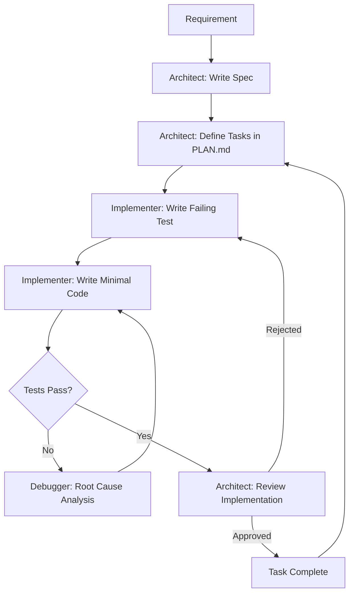

# AI-Assisted Development Workflow

## Overview

This project was built using a structured AI-assisted development methodology called the **Multi-Persona System (MPS)**. Rather than ad-hoc prompting, MPS uses specialized agent roles with clear boundaries, enforced by automated hooks and persistent planning documents.

This document explains the methodology, not to be defensive about AI usage, but because the workflow itself demonstrates valuable software engineering skills: structured planning, separation of concerns, test-driven development, and quality enforcement through automation.

## Agent Roles

### Architect (Planning & Review)
- Creates detailed specifications before any code is written
- Makes and documents architectural decisions in `DECISIONS.md`
- Reviews all implementations against the spec
- Never writes production code directly

### Implementer (Code & Tests)
- Follows strict TDD: writes failing tests first, then minimal code to pass
- Works exclusively from the Architect's specifications
- Cannot modify planning documents or make architectural decisions
- Reports completion with test results

### Debugger (Troubleshooting)
- Activated when tests fail or unexpected behavior occurs
- Follows systematic root cause analysis
- Documents findings for future reference

### Memory Keeper (Continuity)
- Maintains persistent context across sessions via `DECISIONS.md` and `PLAN.md`
- Ensures architectural decisions survive context window limits

## Workflow

## Enforcement Mechanisms

### PreToolUse Hooks
A `PLAN.md` file must exist in the project root before any code edits are allowed. This prevents "freestyle coding" and ensures specification-first development.

### PostToolUse Hooks
After every file edit:
- The formatter (`black`) runs automatically
- Corresponding tests are executed
- Warnings are generated for source files without test coverage

### TDD Cycle
Every feature follows Red-Green-Refactor:
1. **Red**: Write a failing test that defines the expected behavior
2. **Green**: Write the minimum code to make the test pass
3. **Refactor**: Clean up while keeping tests green

## Examples from This Project

### Entropy Calculator
1. Architect specified the Shannon entropy formula and edge cases
2. Implementer wrote 15 tests covering: empty strings, single characters, maximum entropy, known values
3. Implementation followed, passing all tests on first review

### Breach Checker
1. Architect designed the k-anonymity protocol with sequence diagram
2. Implementer wrote tests with mocked HTTP responses
3. Edge cases (network errors, malformed responses, timeouts) were specified upfront

### Password Generator
1. Architect specified CSPRNG requirement and character set options
2. Implementer achieved 100% test coverage
3. Security review confirmed `secrets` usage (not `random`)

## Skills Demonstrated

- **Project management**: Breaking large goals into trackable tasks
- **Specification-driven development**: Writing specs before code
- **Test-driven development**: 111 tests, 92% coverage
- **Quality automation**: Hooks enforce standards on every edit
- **Separation of concerns**: Clear boundaries between planning and implementation
- **Documentation**: Architectural decisions recorded for future reference

## Transferability

This workflow pattern applies to any software project:
- **Solo development**: The role separation prevents cutting corners
- **Team development**: Roles map naturally to team members
- **Code review**: Specs provide clear review criteria
- **Onboarding**: Decision logs explain the "why" behind the code
