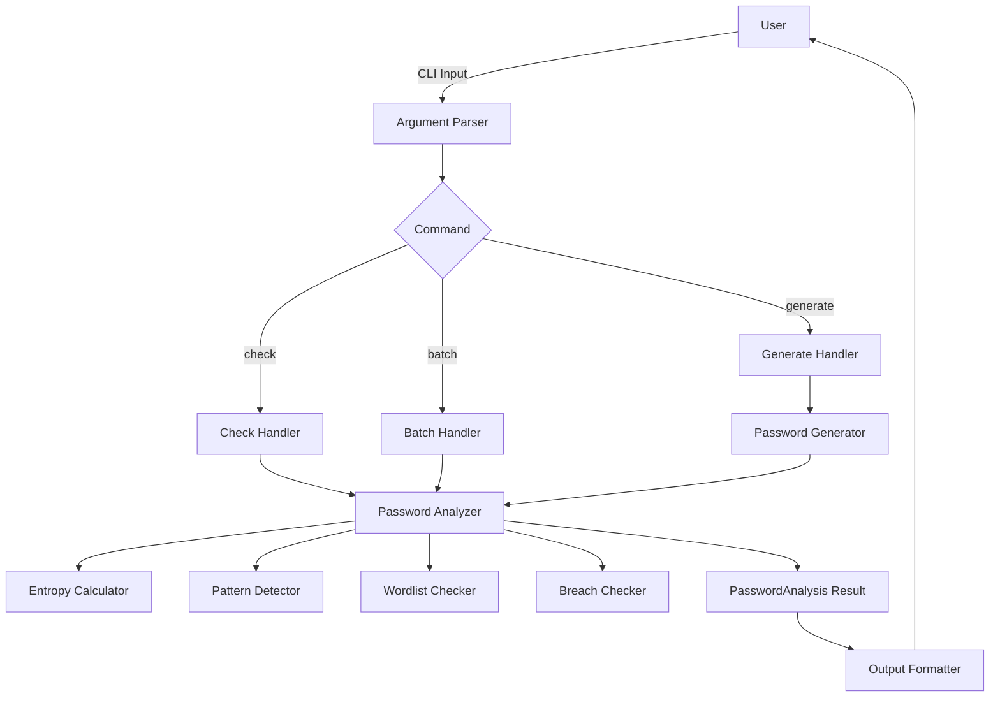
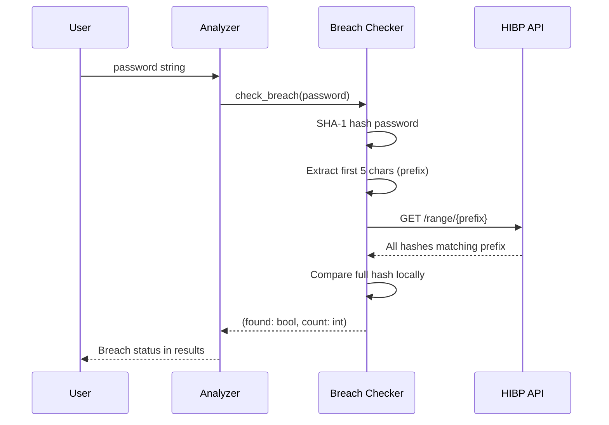
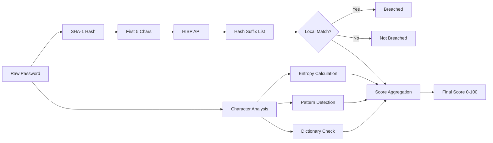

# Architecture

## System Overview

## Components

### Core Modules

#### `core/analyzer.py` — Password Analyzer
The main orchestrator. Takes a password string, coordinates all analysis sub-components, and returns a `PasswordAnalysis` result object. Computes the overall strength score (0-100) by weighting entropy, character diversity, pattern presence, and breach status.

#### `core/entropy.py` — Entropy Calculator
Computes Shannon entropy in bits using the formula `H = log2(N) * L` where N is the character pool size and L is the password length. Also estimates crack times for online (100 attempts/sec) and offline (10 billion attempts/sec) scenarios.

#### `core/breach.py` — Breach Checker (HIBP)
Integrates with the Have I Been Pwned Passwords API using k-anonymity. Only the first 5 characters of the SHA-1 hash are sent over the network.

#### `core/generator.py` — Password Generator
Generates cryptographically secure passwords using Python's `secrets` module. Supports customizable length, character sets, and ambiguous character exclusion.

### Utility Modules

#### `utils/patterns.py` — Pattern Detector
Detects sequential characters (`abc`, `123`), repeated characters (`aaa`), keyboard patterns (`qwerty`), and other common weak patterns.

#### `utils/wordlist.py` — Wordlist Checker
Checks passwords against a dictionary of common words and known weak passwords.

### Interface

#### `cli/commands.py` — Command Handlers
Implements the `check`, `generate`, and `batch` subcommands. Handles argument parsing, user input (secure via `getpass`), and output coordination.

#### `cli/formatters.py` — Output Formatter
Renders analysis results with colorized output (red/yellow/green) using `colorama`. Formats scores, entropy, crack times, and recommendations.

### Data Models

#### `models/analysis.py` — PasswordAnalysis
A dataclass holding all analysis results: score, entropy, crack times, criteria results, breach status, and recommendations.

## K-Anonymity Sequence

## Security Design Decisions

| Decision | Rationale |
|----------|-----------|
| `secrets` not `random` | CSPRNG required for password generation |
| K-anonymity for HIBP | Full password hash never leaves the machine |
| `getpass` for input | Passwords not echoed to terminal |
| No plaintext logging | Passwords never written to disk or logs |
| Input length limits | Prevents resource exhaustion |

## Data Flow

